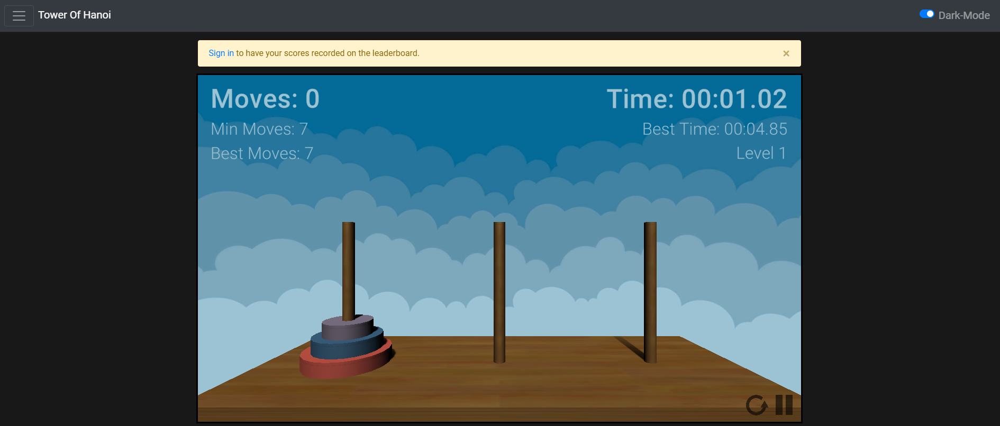

# Tower Of Hanoi
A full-stack MERN website for the Tower of Hanoi game where players can create accounts to have their scores recorded to a leaderboard. The game was built in Unity3D and exported as a WebGL. 

<b>Game source code:</b> <a>https://github.com/ikevinws/TowerOfHanoi</a>

<b>Website: </b> <a>https://tower-of-hanoi-kevin.herokuapp.com</a>



<h2>Installation</h2>

 Setup the project and install the packages by running
```bash
npm run setup
```
 Run project with command
```bash
npm run dev
```

<h2>Built with</h2>
<ul>
    <li>FrontEnd: <b> React.JS, Bootstrap, HTML/CSS </b></li>
    <li>Backend:  <b> Node.JS, Express.JS, Passport.JS </b> </li>
    <li>Database: <b> MongoDB, Mongoose </b> </li>
    <li>Game Engine: <b>Unity3D</b></li>
</ul>

<h2> Features </h2>
<ul>
    <li> Sign In / Sign Up / Sign Out the user. </li>
    <li> A leaderboard that records the player's best time and the number of moves for each level</li>
</ul>

<h2> API </h2>
<h4> Users </h4>
<ul>
  <li> <b>POST</b> /api/users/signup </li>
  <li> <b>POST</b>  /api/users/signin  </li>
  <li> <b>GET</b>  /api/users/signout </li>
  <li> <b>GET</b>  /api/users/checkAuth </li>
</ul>

<h4> Levels </h4>
<ul>
  <li> <b>GET</b> /api/level/getLevels </li>
  <li> <b>GET</b> /api/level/:id </li>
  <li> <b>POST</b> /api/level/addLevel </li>
</ul>

<h2> Credits </h2>
<ul>
  <li>The button icons were obtained from <a>www.flaticon.com</a>.</li>
  <li>The sound effects were obtained from <a>www.zapsplat.com</a>.</li>
  <li>Some assets (wood texture, and skybox) were downloaded from the Unity store.</li> 
</ul>
